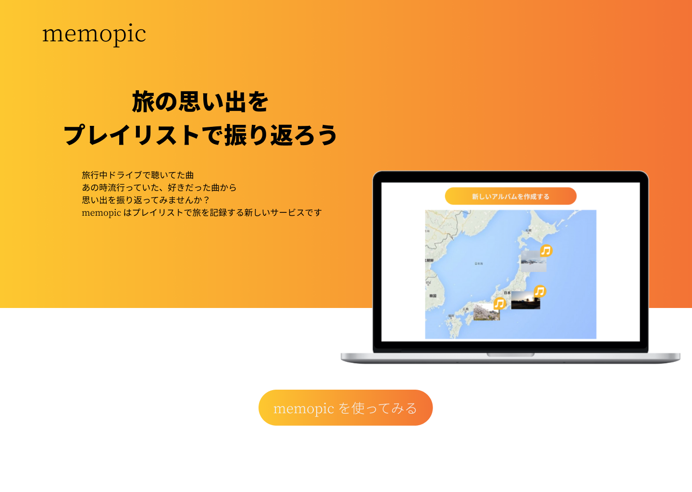

# memopic
## 旅の思い出をプレイリストで振り返ろう

memopic は旅に行った思い出を、プレイリストと写真で記録できるサービスです

↓サイトはこちら  
[memopic](https://www.memopic.net)

<p align="center">

</p>

## 使い方
- 基本的に、いくつかの写真とプレイリストをセットにして、アルバムとして投稿します

- ログインした画面では自分が今までに投稿したアルバムが地図上に表示され、確認できます

- また、リンクを送れば複数人でアルバムを共有することができます

- LINE アカウント、iOS、Android アプリもあり、こちらを使用してアルバムを投稿することもできます(機能拡充中)

## 各種アプリ
- LINE アカウント


- iOS 版  
https://apps.apple.com/jp/app/memopic/id1527852844

- Android版  
https://play.google.com/store/apps/details?id=com.memopic

# 開発環境の立ち上げ方

```
# イメージの作成
$ docker-compose build

# コンテナの立ち上げ
$ docker-compose up -d

# DB の作成とマイグレーション(DB のコンテナを立ち上げ直すたび)
$ docker-compose exec web rails db:create
$ docker-compose exec web rails db:migrate

# テスト
$ docker-compose exec web rspec
```

# 使用技術
- Ruby on Rails, React Native, Tailwind
- MySQL, Redis, Github, CircleCI, puma
- Heroku, AWS S3, GCP, GKE
- LINE, Google, Spotify OAuth
